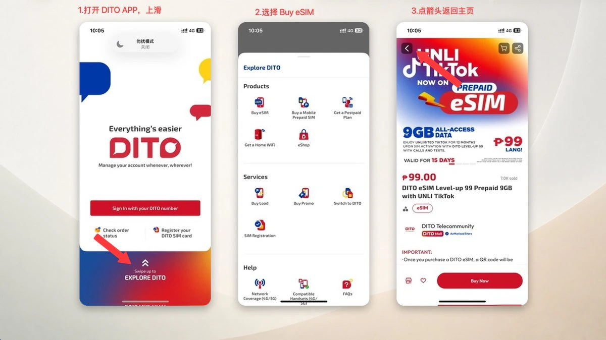
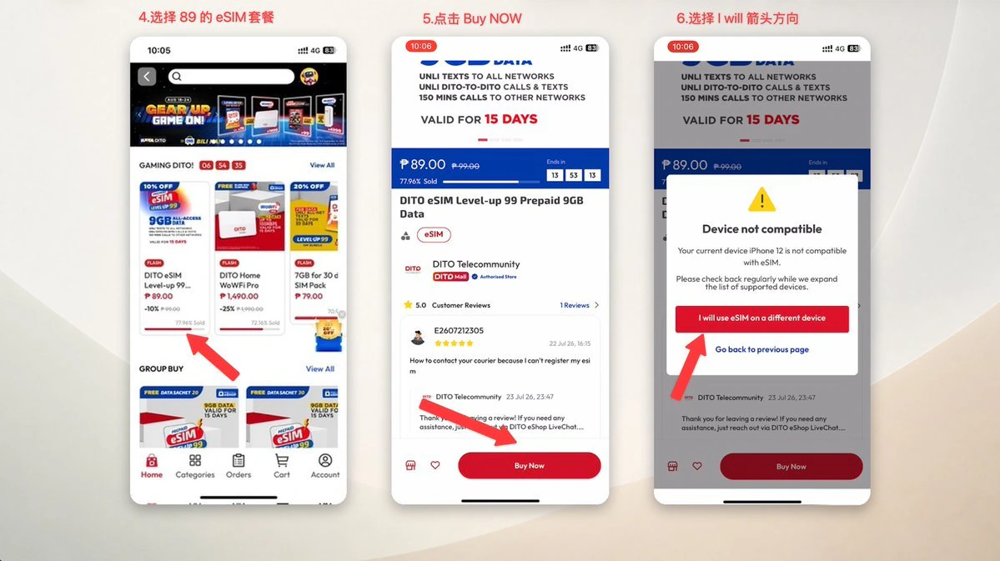
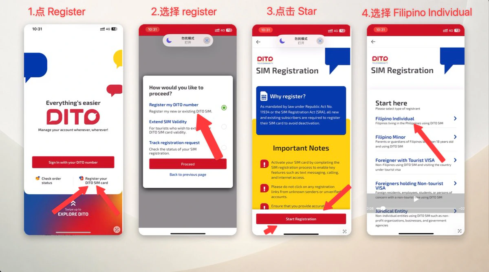
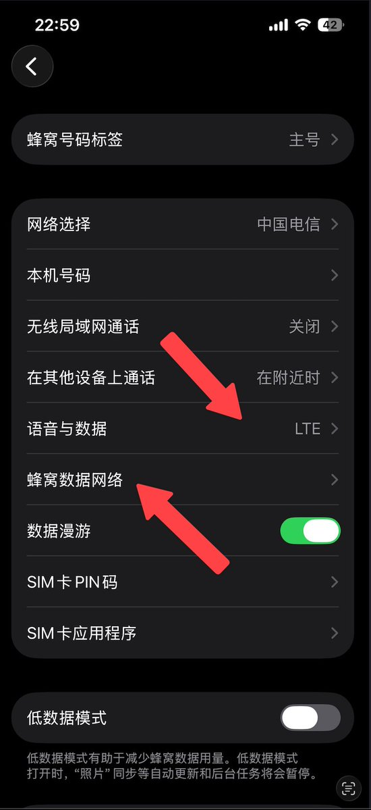
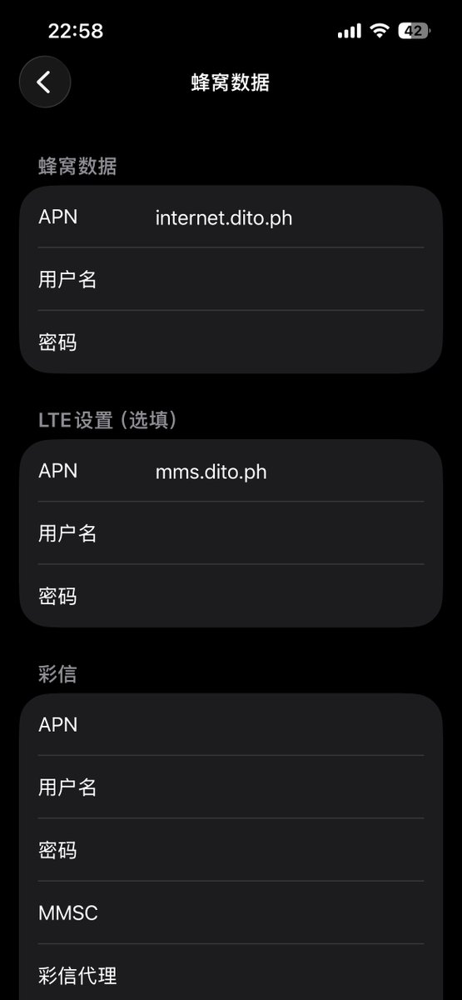
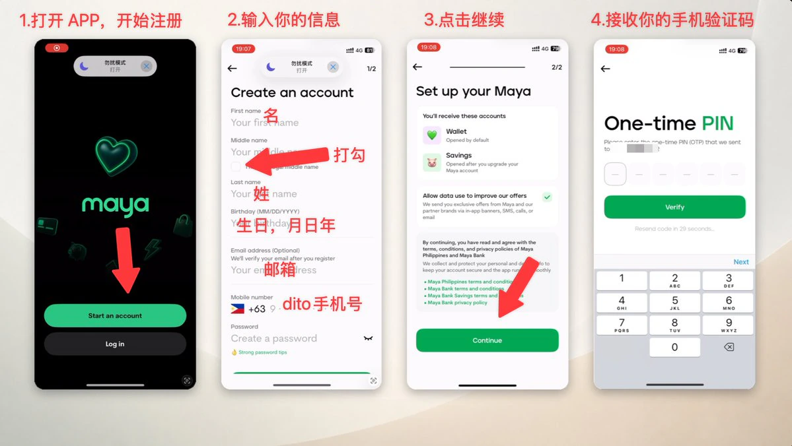
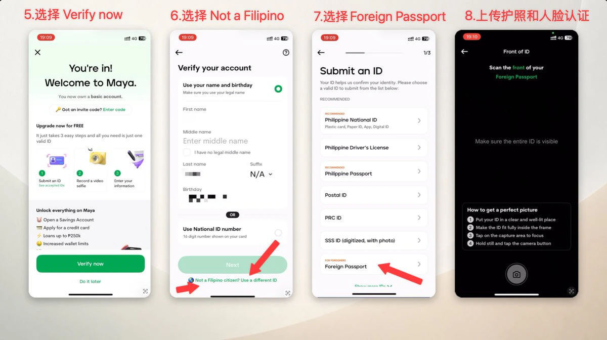
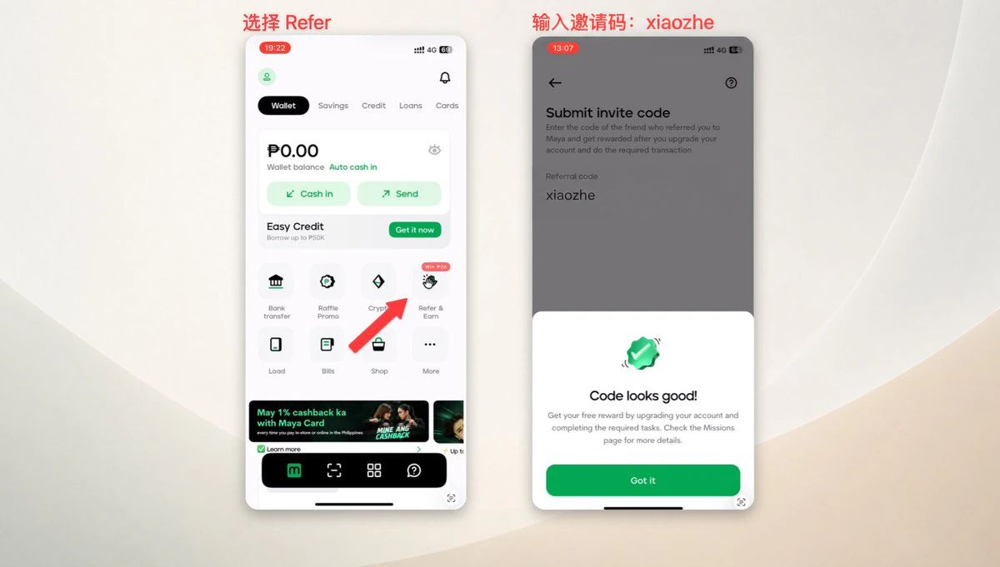
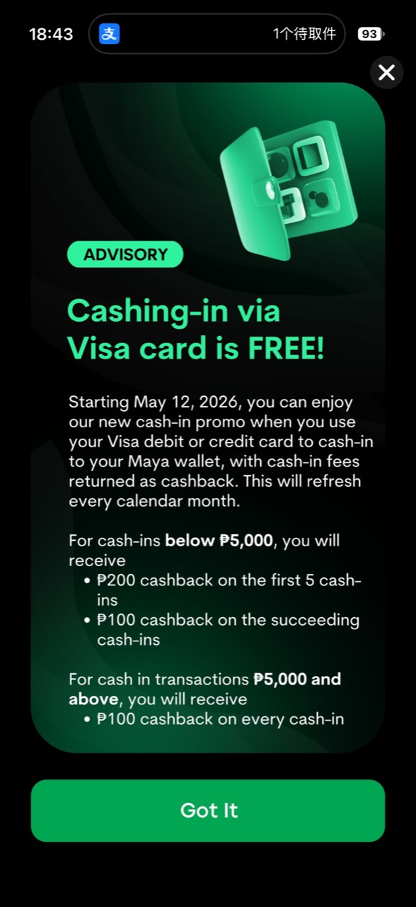

开 Maya 前有一个前置条件：准备一张自己长期持有、可以反复接收短信的菲律宾手机卡。eSIM 和实体卡都可以。我现在用的是 Smart 实体卡，最早是为了开 Spotify 会员买的，后来也用它注册 Maya。

手上还没有菲律宾号码的话，可以直接照着下面的 DITO eSIM 流程买卡、实名和激活。拿到号码后，再开通 Maya Wallet，用中国护照完成认证，继续开 Maya Savings 和虚拟卡，最后从 App 里申请银行证明。

> **不要用一次性接码平台，也不要借别人的菲律宾号码注册 Maya。** 这个 `+63` 号码会长期作为 Maya 的登录和收款标识，转账、交易和修改资料时还要反复接收 OTP。它和银行卡预留手机号一样，是需要长期控制的账户资产。号码停机、被回收或无法收短信，后面找回账户会很麻烦。

本文整理于 2026 年 8 月 25 日。截图里的价格、活动、审核时间和界面都可能变化，操作时以 DITO 与 Maya App 当时显示的内容为准。

> **隐私说明：** 本文只保留不包含账户凭据的截图。邮箱、手机号、OTP、eSIM 二维码、初始密码、证件号、住址、银行账号和交易编号均不进入网站仓库。

## 先分清 Wallet、Savings 和 Card

Maya 把电子钱包、银行存款和支付卡放进了同一个 App。三个入口看起来挨得很近，资金属性却不同。

| 产品 | 账户属性 | 主要用途 | 资金关系 |
| --- | --- | --- | --- |
| Maya Wallet | 菲律宾比索电子钱包 | 收付款、转账、缴费、卡片消费 | 绑定 `+63` 手机号 |
| Maya Savings | Maya Bank 的储蓄账户 | 存款、计息、银行流水与银行证明 | 有独立银行账号，可与 Wallet 互转 |
| Maya Card | Visa 或 Mastercard 支付卡 | 线上支付、线下刷卡、订阅 | 默认从 Wallet 余额扣款 |

入金时要看清楚收款入口。Visa 或 Mastercard 从 `Cash In > Debit or Credit Card` 充值，钱会直接进入 Wallet。Wise 或其他银行选择 `Maya Bank, Inc.`，再填写 12 位 Maya Savings 账号时，钱会进入 Savings。后者的消费路径是 `Savings → Wallet → Maya Card`，先把钱转到 Wallet，虚拟卡才能扣款。

Wallet 由 Maya Philippines, Inc. 提供，不是存款账户，也不在 PDIC 存款保险范围内。Savings 由 Maya Bank, Inc. 提供，属于银行存款。两套法律关系可以在 [Maya 通用条款](https://www.maya.ph/terms-and-conditions)和 [Maya Savings 条款](https://www.mayabank.ph/savings/terms-conditions/)里分别看到。

截至本文整理时，Maya Savings 的基础年利率为 3%，完成当期任务后，前 ₱100,000 的奖励利率最高可到 15%。活动利率不是固定收益，具体档位以 [Maya Savings 官方页面](https://www.mayabank.ph/savings/)和 App 里的 Missions 为准。

## 准备的东西

| 项目 | 用途 |
| --- | --- |
| 自己长期控制的菲律宾手机号 | 注册 Maya、收款和长期接收 OTP，可用 eSIM 或实体卡 |
| 有效中国护照 | DITO SIM 登记和 Maya 身份认证 |
| 支持 eSIM 的手机或写卡设备 | 只有选择 DITO eSIM 时需要 |
| 长期邮箱 | 接收 DITO 订单、二维码和安全通知 |
| 菲律宾地址资料 | SIM 登记和 Maya 的 Current Address |
| 中国常住地址 | Maya 的 Permanent Address |
| 稳定网络 | 下载 eSIM、收 OTP、完成人脸认证 |

原始截图里的 DITO eSIM 活动价是 ₱89，折合人民币约 10 元，包含 9GB 流量和本地通信权益。这个价格来自 2026 年 8 月的活动页面，不应当当作长期固定价格。

## 在 DITO App 里购买 eSIM

打开 DITO App 后，不用先登录。首页向上滑到 `Explore DITO`，进入 `Buy eSIM` 或 eShop。

原始流程选择的是 `DITO eSIM Level-up 99 Prepaid 9GB`。如果当前手机不在兼容列表里，结算前会弹出设备不兼容提示。准备在另一台设备或 eSIM 写卡设备上安装时，可以选择 `I will use eSIM on a different device` 继续。

结算页的交付方式是 Digital Delivery。填写邮箱后点击 `Get Code`，输入邮件验证码，再选择 WeChat Pay。

> 为避免公开结算邮箱、验证码和订单信息，这一步不展示实拍截图。

截图里的实付金额是 10.07 元。支付完成后返回 DITO App，确认订单状态为 Completed，再进入 Order Details 下载 eSIM。

二维码可能需要几分钟生成，DITO 也会向结算邮箱发送一份。下载后应当一起保存这些信息：订单号、手机号码、ICCID、SM-DP+ Address 和 Activation Code。二维码通常只能成功安装一次，不要在多台设备上反复扫描。

> eSIM 邮件、号码、ICCID、激活码与二维码都属于账户凭据，本文不展示原图。

原生支持 eSIM 的手机可以直接在系统设置里添加蜂窝套餐。XeSIM、5ber 一类设备则要在对应 App 里写入配置。

## 完成 DITO SIM 登记

安装 eSIM 后，回到 DITO App，选择 `Register your DITO SIM card`，再进入 `Register my DITO number` 和 `Start Registration`。

登记类型页面同时提供 Filipino Individual、Foreigner with Tourist VISA 和持非旅游签证外国人等入口。原始资料的截图走了 Filipino Individual 路径，实际登记时应按本人身份和系统要求选择。

菲律宾《SIM Registration Act》对外国用户另有材料要求。游客通常需要护照、菲律宾地址证明和返程票，旅游身份登记的 SIM 默认只有 30 天有效期；其他签证类型还会要求对应的居留、工作或学习材料。完整要求可以看 [DITO SIM Registration 页面](https://dito.ph/sim-registration)和 [Republic Act No. 11934](https://lawphil.net/statutes/repacts/ra2022/ra_11934_2022.html)。

接下来输入 DITO 号码并接收 6 位 OTP，证件类型选择 Passport，上传中国护照信息页，再按提示完成人脸自拍。

> 手机号、OTP 和护照页面不公开截图；操作时以 DITO 页面提示为准。

地址页会要求填写房号、街道、城市或省份和邮编。提交后等待审核，成功时会收到号码激活短信和 DITO App 初始密码。

> 住址、手机号和激活短信中的初始密码不公开截图。

## 低成本保号和国内漫游

原始资料的实测方式是在 DITO App 里进入 Buy Load，自定义充值 ₱5，再用微信支付。截图显示这次 0.53 元充值让号码有效期顺延了一年。保号规则可能随套餐和账户状态变化，充值后要回首页确认新的有效期。

> 充值记录会暴露手机号，因此不展示原始截图。

在中国大陆漫游时，号码可能能正常驻网，却收不到验证码。原始排障步骤是把网络制式从 5G Auto 改成 LTE，打开数据漫游，再检查 APN。

蜂窝数据 APN 使用 `internet.dito.ph`。原始截图还把彩信 APN 设置为 `mms.dito.ph`。DITO 官方的 [Help Center](https://dito.ph/help-center)和[漫游说明](https://dito.ph/international/roaming)也要求数据 APN 使用 `internet.dito.ph`。

修改后开关一次飞行模式，让手机重新注册漫游网络。原始资料里通常会连到中国电信或中国联通，短信接收没有额外收费；实际资费仍以 DITO 当期漫游规则为准。

## 注册 Maya Wallet

打开 Maya App，点击 `Start an account`。基础信息里最容易填错的是姓名和日期：

- First name 填护照上的 Given Names。
- Last name 填护照上的 Surname。
- 中国护照没有 Middle Name 时，勾选 `I have no legal middle name`。
- Birthday 按界面要求使用 `MM/DD/YYYY`。
- Mobile number 选择 `+63`，输入自己长期持有的菲律宾号码。走前面 DITO 流程时，这里就是刚激活的 DITO 号码；用 Smart 实体卡也一样。

确认条款后输入短信 OTP，基础版 Maya Wallet 就建好了。

## 用中国护照完成 Maya 账户认证

基础 Wallet 建好后，点击 `Upgrade now for FREE`，或从 Profile 进入账户升级。在 Maya 的界面里，中国护照归在 `Not a Filipino citizen? Use a different ID > Foreign Passport` 这个入口。`Foreign Passport` 是 App 对非菲律宾护照的统称，实际上传的是中国护照。

拍摄中国护照信息页并完成人脸识别后，Maya 会读取姓名、生日、护照号码和到期日。Country of birth 选择 China，Nationality 选择 Chinese。

地址分成两套：Current Address 是菲律宾当前地址，Permanent Address 是中国常住地址。两个地址都要拆成国家、省或地区、城市、Barangay、街道门牌和邮编。

> 护照号码和两套住址不公开截图。

后面还会填写职业、职位、公司、收入或资金来源。FATCA 页面会询问是否为 US person，按自己的真实税务身份选择。提交前再核对姓名、日期、证件号和地址，原始资料中的审核时间大约是 10 到 30 分钟，实际结果由 Maya 决定，也可能要求补充材料。

> 证件号、地址和审核汇总页不公开截图。

中国护照是这条流程里实际使用的证件。Maya Savings 仍由银行自行审核，申请人还要满足 BSP 的客户尽职调查和反洗钱要求，因此提交中国护照不代表每次申请都会自动通过。

## 认证通过后绑定邀请码

账户认证通过后，打开左上角 Profile，进入 `Refer & Earn > Submit invite code`，输入邀请码 `xiaozhe`。这是“小哲”的拼音，页面显示 `Code looks good!` 就说明已经绑定。

这里填的是 Maya 邀请码，不要和 DITO eSIM 邮件里的 Activation Code 混在一起。新人奖励通常还要求完成账户升级和首笔符合条件的交易，具体金额和任务以 App 当时显示为准。

## 开通虚拟卡和 Maya Savings

升级通过后，Cards 页面会出现 Wallet Card。点击 `Activate now` 后可以查看卡号、有效期和 CVV。卡片消费从 Wallet 扣款，钱如果放在 Savings，需要先免费转回 Wallet。

同一个 App 里的 Savings 标签可以开通 Maya Savings。开通后会拿到独立银行账号，Wallet 和 Savings 之间支持即时互转。

> Savings 账号和账户用户名不公开截图。

Maya Bank 是菲律宾中央银行批准经营的数字银行，[BSP 的成立与开业文件](https://www.bsp.gov.ph/Regulations/Issuances/2022/CL-2022-032.pdf)记录了它在 2022 年开始营业。Maya Savings 的存款由 PDIC 承保，截至本文整理时，最高保障为每位存款人在每家银行 ₱1,000,000，最新额度可以在 [PDIC FAQ](https://www.pdic.gov.ph/faqs-4)核对。

## 在 App 里申请银行证明

银行证明来自 Savings，不是 Wallet。路径是：

1. 进入 Savings，点击 `My Savings`。
2. 打开 `View account details`。
3. 点击 `Request a bank certificate`。
4. 选择用途，填写接收方信息和地址。
5. 提交后下载系统生成的 PDF。

> 申请入口截图会显示账户用户名与 Savings 账号，因此不展示原图。

我从 App 里实际生成的文件标题是 `Certificate of Bank Deposit`。这份 PDF 会列出账户持有人、Maya Savings 账号、开户日期、平均日余额、可用余额、签发日期和银行签字，页面底部还有 Maya Bank 的注册地址以及 BSP、PDIC 信息。[Maya 官方的介绍](https://www.maya.ph/stories/why-maya-is-the-best-bank-to-open-an-account-if-youre-a-frequent-traveler)也提到可以直接在 App 内生成 bank certificate。

实际证书包含账户姓名、Maya Savings 账号、参考编号、开户日期、余额和签发日期。即使局部打码，剩余字段组合仍可能识别账户，因此本文不公开实际证书截图。

它可以证明持有人与 Maya Bank 的账户关系、开户时间和资金情况。我会把它作为签证、银行账户审核，或其他平台要求 bank certificate、proof of bank account 时的优先材料。如果对方明确要求 proof of address，需要先核对审核规则。这一版证书没有列出账户持有人的住宅地址，不能保证单独提交就会被当作地址证明接受。

## 入金、转账和出金

### 用 Visa 或 Mastercard 直接给 Wallet 充值

在 Maya Wallet 首页进入 `Cash In > Debit or Credit Card`，可以添加 Visa 或 Mastercard 信用卡、借记卡，再把菲律宾比索直接充进 Wallet。钱到账后不需要经过 Savings，虚拟卡可以直接使用这部分 Wallet 余额。

截至 2026 年 8 月 25 日，我在 Maya App 里看到的 Visa Cash-in 活动仍按自然月计算返现。低于 ₱5,000 的每月前 5 笔各返 ₱200，后续每笔返 ₱100；单笔达到 ₱5,000 时返 ₱100。常用的小额入金在每月前 5 笔可以用返现抵掉 ₱200 手续费，实际相当于免费。返现不是当场免收，也不代表所有金额和笔数都永久免费。

[Maya 当前的 Visa 活动条款](https://www.maya.ph/deals/enjoy-free-cash-in-with-your-visa-credit-debit-or-prepaid-card-2026)把活动期写到 2026 年 12 月 31 日，并注明适用于菲律宾本地发行的 Visa 信用卡、借记卡和预付卡。Mastercard 可以作为 Cash-in 卡片使用，但这张截图和本期返现条款只针对 Visa。境外卡是否能绑定、是否触发返现，要以 Maya 和发卡行的实际结果为准。

### 从 Wise 转入 Maya Savings

在 Wise 里选择菲律宾比索（PHP）和银行账户收款，把自己的 Maya Savings 添加为收款账户。银行选择 `Maya Bank, Inc.`，填写 12 位 Maya Savings 账号。这样走菲律宾本地银行转账，资金会进入 Savings。

到账后，在 Savings 里点击 `Transfer > My Wallet`，把准备消费的金额转到 Wallet，虚拟卡再从 Wallet 扣款。这条资金路径可以记成：`Wise → Maya Savings → Maya Wallet → Maya Card`。

Wise 也支持把 Maya 作为电子钱包收款人。选择 E-Wallet 或 PayMaya，并填写 11 位菲律宾手机号时，钱会进入 Wallet，不会进入 Savings。想让资金留在储蓄账户、形成 Savings 记录时，要确认收款方式是 Bank account，收款银行是 `Maya Bank, Inc.`。Wise 的[菲律宾比索转账说明](https://wise.com/help/articles/2932333/guide-to-php-transfers)列出了银行账户和 Maya 电子钱包两种收款方式，费用和预计到账时间会在确认转账前显示。

### 其他资金路径

**国际汇款平台**，Sendwave、MoneyGram、Ria 等平台可以把菲律宾比索汇入 Maya。活动补贴变化很快，截图里的 ₱1,686 到账只能代表当时那一笔交易，不能当作长期汇率或固定奖励。

> 汇款回单包含账户号、Reference ID 和 Trace No.，因此不展示原图。

**P2P 交易**，在 Binance 或 OKX 的 PHP 交易区出售 USDT，并选择 Maya 或 PayMaya 收款。需要特别注意：如果 Binance 账户的 KYC 地区归属为中国大陆，就无法在 P2P 的 PHP 交易区卖出 USDT，也不能通过这条路径换成菲律宾比索。OKX 也要以账户实际开放的法币市场为准。交易前还要核对对手方信息和资金来源记录。

**菲律宾本地转账**，Maya 支持 InstaPay 和 PESONet。按 [Maya Savings 官方页面](https://www.mayabank.ph/savings/)当前列出的费用，PESONet 转出暂时免费，InstaPay 每笔 ₱15。原始资料里的 ₱10 已经不是当前口径。

**非居民账户入金**，Maya 通用条款对国际账户持有人有单独限制，资金通常应来自外币汇入菲律宾后的比索款项、合规换汇所得，或菲律宾境内财产转换所得。Maya 可能要求提供汇款或换汇凭证。

## 长期使用时容易忘的细节

DITO 号码要定期检查余额和有效期。eSIM 的二维码、ICCID、SM-DP+ 地址和激活码最好一开始就存进密码管理器，换机前先确认能否迁移。

Maya Wallet 与 Savings 要分别看余额。银行证明只反映 Savings 账户记录，卡片则从 Wallet 扣款。

Maya Savings 连续两年没有客户主动存款或取款，会进入 dormant 状态。按当前条款，休眠满五年后才可能收取休眠费，重新启用时可能要再次提交身份材料。

姓名、证件号、出生日期、菲律宾地址和中国地址要保持一致。银行证明、汇款凭证和账户流水也建议单独备份，后面遇到审核时比重新解释资金链路省事。

## 参考资料

- [DITO SIM Registration](https://dito.ph/sim-registration)
- [Republic Act No. 11934](https://lawphil.net/statutes/repacts/ra2022/ra_11934_2022.html)
- [DITO Help Center](https://dito.ph/help-center)
- [DITO International Roaming](https://dito.ph/international/roaming)
- [Maya Terms and Conditions](https://www.maya.ph/terms-and-conditions)
- [Maya Savings](https://www.mayabank.ph/savings/)
- [Maya Savings Terms and Conditions](https://www.mayabank.ph/savings/terms-conditions/)
- [Maya Visa Cash-in Cashback](https://www.maya.ph/deals/enjoy-free-cash-in-with-your-visa-credit-debit-or-prepaid-card-2026)
- [Wise: Guide to PHP transfers](https://wise.com/help/articles/2932333/guide-to-php-transfers)
- [BSP: Maya Bank Establishment and Commencement of Operations](https://www.bsp.gov.ph/Regulations/Issuances/2022/CL-2022-032.pdf)
- [PDIC Frequently Asked Questions](https://www.pdic.gov.ph/faqs-4)

我自己会把这套账户按资金路径来记：菲律宾手机号负责登录、收款标识和 OTP；Maya Savings 接银行转账、存款和银行证明；Maya Wallet 负责日常收付款；虚拟卡只消费 Wallet 余额。四个位置对上以后，入金和消费就不容易走错入口。
